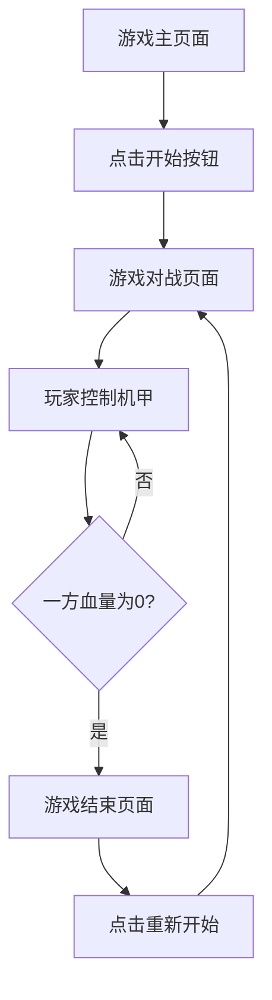

## 1. Product Overview
像素风机甲对战小游戏是一款复古风格的双人对战游戏，玩家可以控制机甲进行移动、攻击和防御。
- 游戏旨在提供简单易上手但富有挑战性的对战体验，适合休闲玩家。
- 目标用户为喜欢复古游戏风格和对战游戏的玩家群体。

## 2. Core Features

### 2.1 User Roles
| Role | Registration Method | Core Permissions |
|------|---------------------|------------------|
| Player 1 | No registration required | Control机甲1进行游戏 |
| Player 2 | No registration required | Control机甲2进行游戏 |

### 2.2 Feature Module
1. **游戏主页面**: 游戏标题、开始按钮、操作说明
2. **游戏对战页面**: 机甲对战场景、控制区域、状态显示
3. **游戏结束页面**: 胜负结果、重新开始按钮

### 2.3 Page Details
| Page Name | Module Name | Feature description |
|-----------|-------------|---------------------|
| 游戏主页面 | 游戏标题 | 显示游戏名称和像素风格的机甲图像 |
| 游戏主页面 | 开始按钮 | 点击开始游戏，进入对战页面 |
| 游戏主页面 | 操作说明 | 显示两个玩家的控制方式 |
| 游戏对战页面 | 对战场景 | 显示机甲、背景和战斗效果 |
| 游戏对战页面 | 控制区域 | 玩家1和玩家2的控制按钮 |
| 游戏对战页面 | 状态显示 | 显示两个机甲的血量和能量值 |
| 游戏结束页面 | 胜负结果 | 显示获胜玩家和战斗结果 |
| 游戏结束页面 | 重新开始按钮 | 点击重新开始游戏 |

## 3. Core Process
游戏流程：
1. 玩家打开游戏主页面
2. 阅读操作说明后点击开始按钮
3. 进入对战页面，玩家1和玩家2分别控制自己的机甲
4. 玩家通过键盘或屏幕按钮控制机甲移动、攻击和防御
5. 当一方机甲血量为0时，游戏结束
6. 显示游戏结束页面，展示获胜者
7. 玩家可选择重新开始游戏

## 4. User Interface Design
### 4.1 Design Style
- 主色调：深蓝色(#1a2b3c)和亮橙色(#ff7f00)作为主要颜色
- 次要色调：灰色(#888888)和白色(#ffffff)作为辅助颜色
- 按钮风格：像素风格，3D效果，有明显的点击反馈
- 字体：像素风格字体，如Press Start 2P
- 布局风格：复古街机风格，简洁明了
- 图标风格：像素风格，8-bit或16-bit效果

### 4.2 Page Design Overview
| Page Name | Module Name | UI Elements |
|-----------|-------------|-------------|
| 游戏主页面 | 游戏标题 | 大尺寸像素字体，居中显示，带有简单动画效果 |
| 游戏主页面 | 开始按钮 | 像素风格按钮，悬停时有放大效果 |
| 游戏主页面 | 操作说明 | 分两栏显示，左侧玩家1，右侧玩家2，使用图标和文字说明 |
| 游戏对战页面 | 对战场景 | 2D像素风格背景，两个机甲角色，战斗特效使用像素风格动画 |
| 游戏对战页面 | 控制区域 | 屏幕下方的虚拟按钮（移动、攻击、防御），键盘按键提示 |
| 游戏对战页面 | 状态显示 | 屏幕上方的血量条和能量条，使用不同颜色区分两个玩家 |
| 游戏结束页面 | 胜负结果 | 大字体显示获胜玩家，带有庆祝动画效果 |
| 游戏结束页面 | 重新开始按钮 | 像素风格按钮，点击后重新加载游戏 |

### 4.3 Responsiveness
- 设计采用桌面优先原则，同时支持移动设备
- 在移动设备上，控制区域会自动调整为屏幕下方的虚拟按钮
- 在桌面设备上，优先使用键盘控制，并显示键盘按键提示

### 4.4 3D Scene Guidance
- 本游戏为2D像素风格，不包含3D场景
