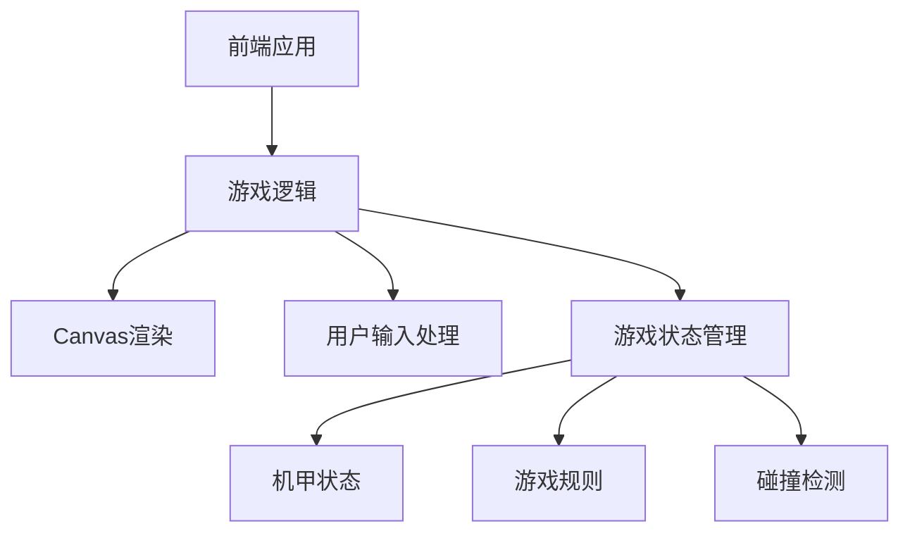
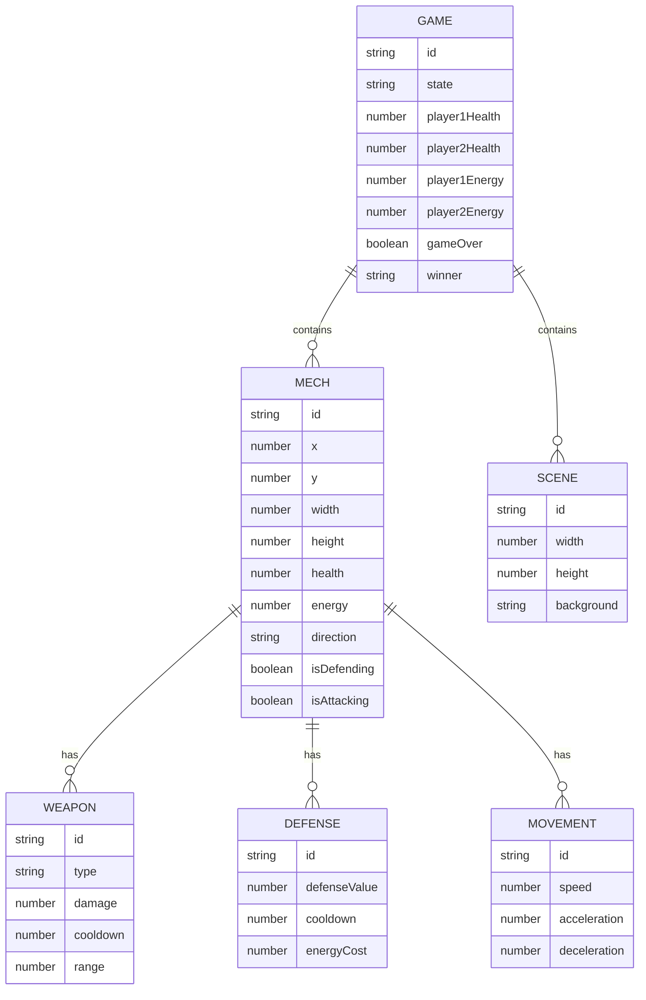

## 1. Architecture Design

## 2. Technology Description
- Frontend: React@18 + tailwindcss@3 + vite
- Initialization Tool: vite-init
- Backend: None (纯前端游戏)
- Database: None (游戏状态存储在内存中)
- 游戏渲染: HTML5 Canvas
- 动画处理: requestAnimationFrame
- 状态管理: React useState和useEffect

## 3. Route Definitions
| Route | Purpose |
|-------|---------|
| / | 游戏主页面 |
| /game | 游戏对战页面 |
| /game-over | 游戏结束页面 |

## 4. API Definitions
- 无后端API，游戏逻辑完全在前端实现

## 5. Server Architecture Diagram
- 无后端服务器架构

## 6. Data Model
### 6.1 Data Model Definition

### 6.2 Data Definition Language
- 无数据库，游戏状态使用JavaScript对象存储
