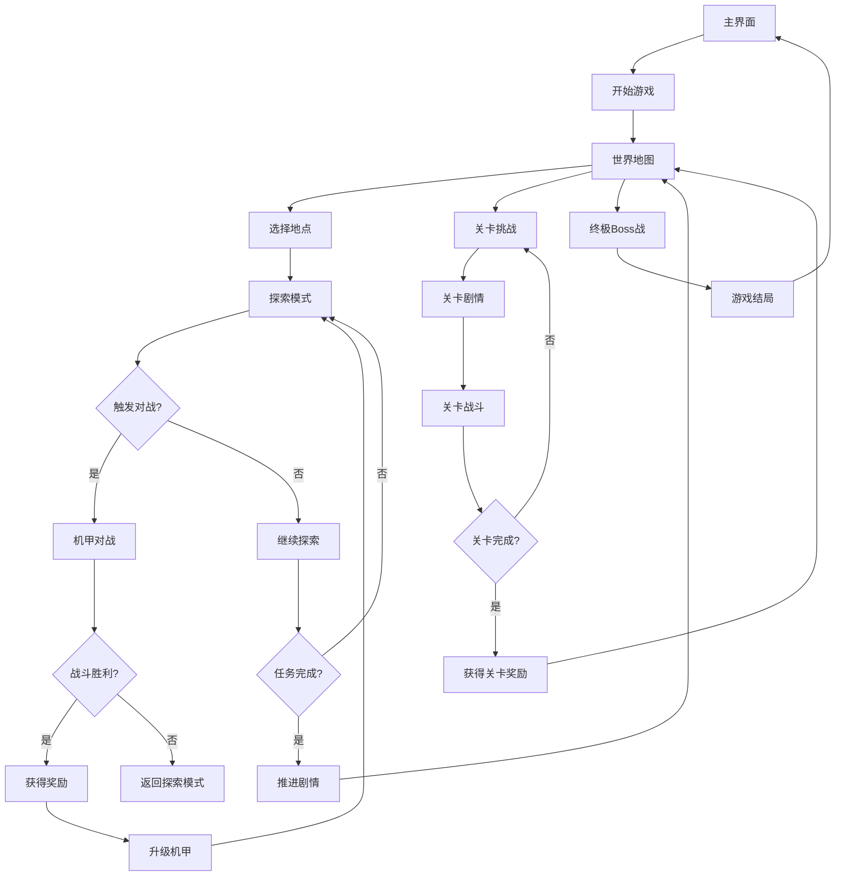

## 1. Product Overview
《倚天机甲传》是一款结合经典武侠小说《倚天屠龙记》与复古像素风格的动作冒险游戏。玩家将扮演张无忌，通过探索江湖、收集资源、升级机甲，最终与各大门派高手进行机甲对战，成为武林盟主。
- 游戏旨在为玩家提供一个融合武侠元素与科幻机甲的独特游戏体验，适合喜欢武侠题材和动作游戏的玩家。
- 目标用户为18-35岁的游戏玩家，特别是喜欢复古游戏风格和武侠文化的群体。

## 2. Core Features

### 2.1 User Roles
| Role | Registration Method | Core Permissions |
|------|---------------------|------------------|
| 玩家 | No registration required | 控制张无忌进行游戏，探索世界，与NPC交互，进行机甲对战 |

### 2.2 Feature Module
1. **主界面**: 游戏标题、开始游戏、设置、关于
2. **世界地图**: 可探索的武侠世界，包含多个地点
3. **探索模式**: 角色移动、与NPC对话、收集资源
4. **机甲对战**: 核心战斗系统，支持1v1对战
5. **机甲升级**: 升级机甲部件，提升战斗力
6. **剧情系统**: 基于倚天屠龙记的故事情节
7. **成就系统**: 完成特定任务获得成就
8. **关卡系统**: 基于倚天屠龙记故事情节的关卡设计

### 2.3 Page Details
| Page Name | Module Name | Feature description |
|-----------|-------------|---------------------|
| 主界面 | 游戏标题 | 显示游戏名称和像素风格的张无忌机甲图像 |
| 主界面 | 开始游戏 | 点击进入游戏，选择存档或新游戏 |
| 主界面 | 设置 | 调整游戏音量、控制方式等 |
| 主界面 | 关于 | 显示游戏版本和制作信息 |
| 世界地图 | 地点选择 | 显示可探索的地点，如武当山、明教总坛等 |
| 世界地图 | 剧情提示 | 显示当前剧情进度和任务目标 |
| 探索模式 | 角色移动 | 控制张无忌在场景中移动 |
| 探索模式 | NPC交互 | 与游戏中的NPC对话，接受任务 |
| 探索模式 | 资源收集 | 收集游戏中的资源，用于升级机甲 |
| 机甲对战 | 战斗场景 | 显示机甲对战画面，支持1v1对战 |
| 机甲对战 | 控制区域 | 玩家控制按钮，包括移动、攻击、防御等 |
| 机甲对战 | 状态显示 | 显示机甲的血量、能量和特殊技能 |
| 机甲升级 | 部件选择 | 选择要升级的机甲部件 |
| 机甲升级 | 资源消耗 | 显示升级所需的资源和效果 |
| 剧情系统 | 对话界面 | 显示游戏剧情对话 |
| 剧情系统 | 任务追踪 | 显示当前任务和完成进度 |
| 成就系统 | 成就列表 | 显示已获得和未获得的成就 |
| 成就系统 | 奖励领取 | 领取成就奖励 |
| 关卡系统 | 关卡选择 | 显示可挑战的关卡 |
| 关卡系统 | 关卡剧情 | 每个关卡的背景故事和任务目标 |

## 3. Core Process
游戏流程：
1. 玩家打开游戏主界面
2. 点击开始游戏，选择新游戏或加载存档
3. 进入世界地图，选择要探索的地点
4. 在探索模式中与NPC交互，完成任务，收集资源
5. 当遇到敌人或触发特定剧情时，进入机甲对战模式
6. 在机甲对战中击败对手，获得奖励
7. 使用收集的资源升级机甲
8. 继续探索世界，推进剧情
9. 解锁并挑战关卡，完成倚天屠龙记的经典故事情节
10. 最终与终极Boss进行决战

## 4. User Interface Design
### 4.1 Design Style
- 主色调：古铜色(#cd7f32)和深红色(#8b0000)作为主要颜色，体现武侠风格
- 次要色调：灰色(#888888)和白色(#ffffff)作为辅助颜色
- 按钮风格：像素风格，带有武侠元素，如剑形、令牌形按钮
- 字体：像素风格字体，如Press Start 2P，标题使用仿宋风格
- 布局风格：复古街机风格与武侠元素结合，简洁明了
- 图标风格：像素风格，融合武侠元素，如武器、丹药等

### 4.2 Page Design Overview
| Page Name | Module Name | UI Elements |
|-----------|-------------|-------------|
| 主界面 | 游戏标题 | 大尺寸像素字体，居中显示，带有武侠风格的动画效果 |
| 主界面 | 开始游戏 | 像素风格按钮，带有剑形图标，悬停时有发光效果 |
| 主界面 | 设置 | 像素风格按钮，带有齿轮图标 |
| 主界面 | 关于 | 像素风格按钮，带有卷轴图标 |
| 世界地图 | 地点选择 | 像素风格的地图，可点击的地点标记，带有武侠风格的地点名称 |
| 世界地图 | 剧情提示 | 卷轴风格的文本框，显示当前剧情进度 |
| 探索模式 | 角色移动 | 像素风格的张无忌角色，支持方向键控制 |
| 探索模式 | NPC交互 | 像素风格的NPC角色，对话时显示对话框 |
| 探索模式 | 资源收集 | 像素风格的资源图标，点击后显示获得的资源数量 |
| 机甲对战 | 战斗场景 | 2D像素风格背景，带有武侠元素的机甲角色，战斗特效使用像素风格动画 |
| 机甲对战 | 控制区域 | 屏幕下方的虚拟按钮，带有武侠风格的图标 |
| 机甲对战 | 状态显示 | 屏幕上方的血量条和能量条，使用不同颜色区分 |
| 机甲升级 | 部件选择 | 像素风格的机甲部件图标，点击后显示详细信息 |
| 机甲升级 | 资源消耗 | 显示升级所需的资源数量和升级后的效果 |
| 剧情系统 | 对话界面 | 卷轴风格的对话框，带有角色头像 |
| 剧情系统 | 任务追踪 | 屏幕右侧的任务列表，显示当前任务和完成进度 |
| 成就系统 | 成就列表 | 像素风格的成就图标，显示已获得和未获得的成就 |
| 成就系统 | 奖励领取 | 点击领取成就奖励，显示获得的资源和物品 |
| 关卡系统 | 关卡选择 | 像素风格的关卡图标，显示关卡名称和难度 |
| 关卡系统 | 关卡剧情 | 卷轴风格的剧情展示，带有角色对话 |

### 4.3 Responsiveness
- 设计采用桌面优先原则，同时支持移动设备
- 在移动设备上，控制区域会自动调整为屏幕下方的虚拟按钮
- 在桌面设备上，优先使用键盘控制，并显示键盘按键提示

### 4.4 3D Scene Guidance
- 本游戏为2D像素风格，不包含3D场景

## 5. Technical Architecture
### 5.1 Technology Stack
- Frontend: React 18 + TypeScript + Tailwind CSS + Vite
- Game Rendering: HTML5 Canvas
- Animation: requestAnimationFrame
- State Management: Zustand
- Routing: React Router DOM
- Icons: Lucide React

### 5.2 Data Model
| Entity | Attributes | Description |
|--------|------------|-------------|
| Player | id, name, level, experience, resources, currentLocation | 玩家信息 |
| Mech | id, name, health, energy, attack, defense, speed, parts | 机甲信息 |
| Location | id, name, description, NPCs, resources, events | 地点信息 |
| NPC | id, name, dialogues, quests, rewards | NPC信息 |
| Quest | id, name, description, objectives, rewards, status | 任务信息 |
| Resource | id, name, type, quantity, description | 资源信息 |
| Achievement | id, name, description, condition, reward, status | 成就信息 |
| Level | id, name, description, story, objectives, enemies, rewards | 关卡信息 |

## 6. Gameplay Design
### 6.1 Story Background
游戏背景设定在元末明初，武林中流传着“武林至尊，宝刀屠龙，号令天下，莫敢不从，倚天不出，谁与争锋”的传言。玩家扮演张无忌，一个身世坎坷的少年，意外获得了九阳真经和乾坤大挪移的机甲技术图纸，开始了他的江湖之旅。

### 6.2 Level Design
#### 关卡1：蝴蝶谷奇遇
- **背景故事**：张无忌在蝴蝶谷遇到胡青牛，学习医术的同时，发现了隐藏的机甲技术图纸。
- **任务目标**：收集草药，帮助胡青牛治疗病人，获得九阳真经机甲图纸。
- **敌人**：元兵机甲部队
- **奖励**：九阳真经机甲核心，初级机甲部件

#### 关卡2：光明顶之战
- **背景故事**：张无忌前往光明顶，帮助明教抵御六大派的围攻。
- **任务目标**：击败六大派的机甲高手，保护明教总坛。
- **敌人**：六大派机甲部队，成昆机甲
- **奖励**：乾坤大挪移机甲核心，中级机甲部件

#### 关卡3：大都救赵敏
- **背景故事**：赵敏被元廷囚禁，张无忌前往大都营救。
- **任务目标**：突破元廷机甲防线，救出赵敏。
- **敌人**：元廷精锐机甲部队，玄冥二老机甲
- **奖励**：赵敏作为战斗伙伴，高级机甲部件

#### 关卡4：灵蛇岛夺刀
- **背景故事**：张无忌与赵敏、周芷若等人前往灵蛇岛，寻找屠龙刀。
- **任务目标**：击败波斯明教机甲部队，夺取屠龙刀。
- **敌人**：波斯明教机甲部队，金花婆婆机甲
- **奖励**：屠龙刀机甲武器，顶级机甲部件

#### 关卡5：最终决战
- **背景故事**：张无忌与朱元璋的机甲部队展开最终决战，争夺武林盟主之位。
- **任务目标**：击败朱元璋的机甲部队，成为武林盟主。
- **敌人**：朱元璋机甲部队，终极Boss朱元璋机甲
- **奖励**：倚天剑机甲武器，游戏结局

### 6.3 Exploration Mode
- 玩家可以在世界地图上选择不同的地点进行探索
- 在探索过程中，玩家可以与NPC对话，接受任务
- 玩家可以收集资源，用于升级机甲
- 探索过程中会随机遇到敌人，触发机甲对战

### 6.4 Mech Battle Mode
- 核心战斗系统，基于现有的机甲对战机制
- 玩家可以控制机甲进行移动、攻击、防御等操作
- 机甲有血量和能量值，能量值用于释放特殊技能
- 战斗胜利后获得经验和资源奖励

### 6.5 Mech Upgrade System
- 玩家可以升级机甲的各个部件，如武器、护甲、引擎等
- 升级需要消耗特定的资源
- 不同的部件升级会提升机甲的不同属性

### 6.6 Quest System
- 基于倚天屠龙记的故事情节设计任务
- 玩家需要完成各种任务来推进剧情
- 任务包括收集物品、击败敌人、与特定NPC对话等

### 6.7 Achievement System
- 玩家可以通过完成特定的游戏目标获得成就
- 成就包括击败特定敌人、收集特定资源、完成特定任务等
- 获得成就可以领取奖励，如稀有资源、特殊机甲部件等

## 7. Easter Eggs
1. **九阳神功**：在蝴蝶谷找到九阳真经，获得特殊技能
2. **屠龙宝刀**：收集特定资源后可以打造屠龙宝刀，大幅提升机甲攻击力
3. **倚天剑**：完成特定任务后获得倚天剑，提升机甲速度和攻击范围
4. **张三丰**：在武当山遇到张三丰，获得高级机甲升级图纸
5. **明教圣火令**：收集圣火令后可以解锁隐藏的明教机甲
6. **赵敏**：完成与赵敏相关的任务后，获得赵敏作为战斗伙伴
7. **周芷若**：在特定剧情中选择正确的选项，获得周芷若的帮助
8. **谢逊**：找到谢逊后，获得屠龙刀的使用方法
9. **小昭**：在波斯明教总部找到小昭，获得波斯机甲技术
10. **张翠山**：在冰火岛找到张翠山的遗迹，获得武当派机甲技术

## 8. Not To Do List
1. ❌ 不使用3D渲染，保持2D像素风格
2. ❌ 不添加多人在线功能，保持单机游戏体验
3. ❌ 不设计过于复杂的控制系统，保持简单易上手
4. ❌ 不添加付费内容，保持游戏的完整性
5. ❌ 不偏离倚天屠龙记的基本故事情节
6. ❌ 不设计过于血腥的战斗场景，保持游戏的适合年龄
7. ❌ 不添加不必要的收集要素，保持游戏的流畅性

## 9. Soul Questions
### 9.1 What problem does this game solve?
- 为玩家提供一个融合武侠元素与科幻机甲的独特游戏体验，满足玩家对武侠题材游戏的需求
- 为喜欢复古游戏风格的玩家提供一个高质量的像素风游戏
- 为倚天屠龙记的粉丝提供一个全新的故事呈现方式
- 为玩家提供一个沉浸式的单机游戏体验，远离在线游戏的喧嚣

### 9.2 Why should players choose this game?
- 独特的武侠+机甲融合题材，区别于传统的武侠游戏和机甲游戏
- 丰富的剧情和探索内容，基于经典武侠小说倚天屠龙记
- 简单易上手的操作方式，适合休闲玩家
- 复古像素风格，唤起玩家的怀旧情感
- 多样化的关卡设计，提供不同的游戏体验

### 9.3 What makes this game unique?
- 将经典武侠小说与科幻机甲元素相结合，创造独特的游戏世界
- 像素风格的武侠机甲设计，具有视觉冲击力
- 基于倚天屠龙记的故事情节，为玩家提供熟悉又新鲜的游戏体验
- 丰富的探索内容和彩蛋设计，增加游戏的可玩性
- 多样化的关卡设计，每个关卡都有独特的背景故事和游戏体验

## 10. Implementation Plan
1. **Phase 1: Core System Development**
   - 完善现有的机甲对战系统
   - 开发世界地图和探索模式
   - 实现基本的剧情系统

2. **Phase 2: Content Expansion**
   - 设计并实现多个游戏地点
   - 开发NPC和任务系统
   - 实现机甲升级系统
   - 设计并实现关卡系统

3. **Phase 3: Polish and Testing**
   - 添加成就系统
   - 实现彩蛋内容
   - 优化游戏性能和用户体验
   - 进行游戏测试和bug修复

## 11. Risk Management
1. **Technical Risk**：Canvas渲染性能问题
   - 解决方案：优化渲染代码，使用requestAnimationFrame的最佳实践

2. **Content Risk**：剧情与原著不符
   - 解决方案：仔细研究倚天屠龙记原著，确保剧情的准确性

3. **User Experience Risk**：游戏操作复杂
   - 解决方案：保持简单的控制系统，提供详细的操作说明

4. **Performance Risk**：游戏加载时间过长
   - 解决方案：优化资源加载，使用懒加载技术

5. **Compatibility Risk**：在不同设备上的表现不一致
   - 解决方案：进行多设备测试，确保游戏在不同设备上的兼容性

6. **Content Risk**：关卡设计过于简单或困难
   - 解决方案：进行游戏测试，调整关卡难度，确保游戏的平衡性

7. **Technical Risk**：游戏存档系统问题
   - 解决方案：实现本地存储功能，确保游戏进度可以保存和加载